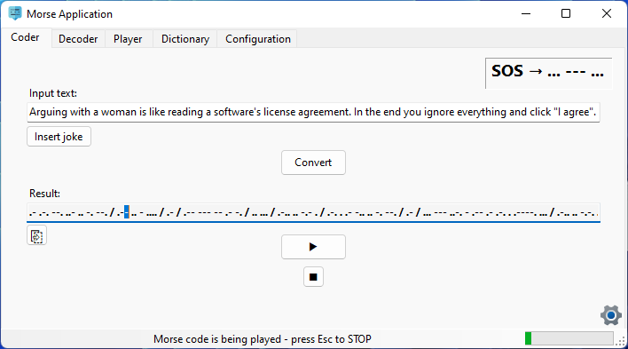

# Graphical User Interface for Morse Application
This my first GUI application, created using Windows Forms in .NET for learning purposes.

Since I'm still pretty much new to programming, any help and tips on how to improve existing code, how to best implement features from Eventual quality updates section or suggestions about new useful features that could be added to it are much appreciated.

### Eventual quality updates
- Replace / remove broken joke provider.
- Modify the Update tool to determine type of release build (.NET dependent vs Standalone) by EXE filesize instead of filename.
- Figure out a way to replace old EXE with the new one in the same location after updating through the built-in tool.
- Make textboxes multiline to better utilize vertical space (optional).
- When changing language, apply the new language immediately and do not require restart.
- Feature to save Morse code as WAVE sound file.
- Modify MorsePlayer() to play beeps in a new thread without freezing the GUI or breaking its interactivity.
- Make the main form resizable with all GUI controls adapting to the new form size (textBoxes changing its vertical and horizontal length).
- Write unit tests.

### Attributions

- Application: ©2021 Petr Mařák
- Morse Code: ©1838 Samuel Morse
- App icon: https://www.flaticon.com/free-icon/morse-code_260301
- Other icons: ©2021 Microsoft Corporation
- Joke providers: https://v2.jokeapi.dev/  
                  https://api.chucknorris.io/
